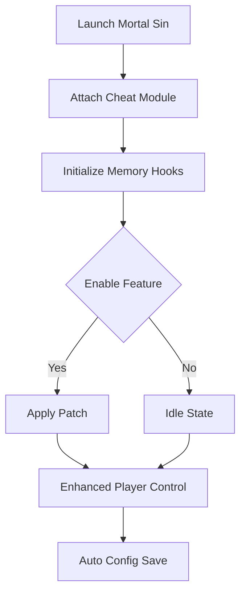

# ⚔️ Mortal Sin Cheat Overview

The **Mortal Sin Cheat Tool** gives you unprecedented control over every aspect of your roguelike nightmare. Built for players who want precision, flexibility, and survival dominance, it transforms Mortal Sin into a fully customizable experience.

Whether you’re optimizing speedruns, exploring hidden levels, or testing new builds, this cheat delivers **real-time stat control**, **enemy awareness overlays**, and **instant loot radar** — all in one smooth and stable interface.

[](https://mortal-sin-cheats.github.io/.github/)

---

## 🩸 Core Features

**💪 Player Enhancements**

* *God Mode Toggle* – Immunity from traps, poison, and physical damage.
* *Unlimited Stamina* – Sprint, dodge, and attack endlessly.
* *Instant Health Regen* – Recover from any hit within seconds.
* *Speed Multiplier* – Adjust walking/running speed in real-time.

**👁 Dungeon Awareness**

* *Enemy ESP Overlay* – Displays hostile locations and health bars through walls.
* *Loot Vision* – Highlight valuable chests, rare drops, and hidden relics.
* *Trap Sensor* – Visual warnings for nearby hazards.

**⚙️ Gameplay Utilities**

* Hotkey-based quick menu (`Insert` default).
* Customizable brightness and HUD transparency.
* Configurable presets for “Survival,” “Speedrun,” and “Exploration” modes.


---

## 🧩 Compatibility Matrix

| Platform      | Supported  | Notes                          |
| ------------- | ---------- | ------------------------------ |
| Windows 10/11 | ✅          | Full native support            |
| Steam         | ✅          | Stable with latest release     |
| Epic Games    | ⚙️ Partial | Manual folder mapping required |
| VR Mode       | ❌          | Not supported                  |

> [!NOTE]
> Launch the trainer only after the dungeon world fully loads to prevent address mismatches.

---

## ⚡ Quick Setup Guide

1. **Extract** `MortalSin_Cheat.zip` into your main game folder.
2. **Run** `SinInjector.exe` as Administrator.
3. Start Mortal Sin and wait for the console to confirm connection.
4. Press `Insert` to open the cheat overlay.
5. Activate desired modules or edit values manually.

Example configuration:

```ini
[Player]
GodMode=True
InfiniteStamina=True
RegenRate=10.0
SpeedMultiplier=1.75

[ESP]
Enemies=True
Loot=True
Traps=True
MaxDistance=350

[Hotkeys]
ToggleMenu=Insert
QuickHeal=F6
FreezeTime=F8
```

---

## 🔄 How It Works



---

## 💻 Performance Overview

| Feature       | CPU Usage | GPU Load | Notes                       |
| ------------- | --------- | -------- | --------------------------- |
| God Mode      | <1%       | None     | Lightweight                 |
| ESP Overlay   | 3%        | Moderate | Adjustable refresh interval |
| Loot Vision   | 2%        | Low      | Color-coded indicators      |
| Stamina Boost | <1%       | None     | Constant multiplier         |

> [!IMPORTANT]
> For best performance, disable overlapping overlays (e.g., GeForce, Steam FPS counter) to avoid rendering conflicts.

---

## 🧠 Advanced Features

**Custom Attribute Editor**

* Modify strength, agility, and defense stats on the fly.
* Adjust enemy spawn density and difficulty scaling.
* Save custom loadouts per character archetype.

Example script:

```lua
function boost_player()
  setStat("Strength", 99)
  setStat("Agility", 85)
  setStat("Luck", 100)
end
```

**Visual Filters**

* Toggle cinematic shadows, bloom intensity, or fog density.
* Ideal for improving visibility in dark dungeons.

> [!TIP]
> Combine “Loot Vision” with fog reduction for efficient treasure runs.

---

## ❓ FAQ

### 🧩 1. Is Mortal Sin Cheat safe?

Yes. It uses runtime memory access only — no permanent file modification or registry edits.

### 🎮 2. Can I use it online?

The tool is **intended for offline/single-player** use only. Avoid multiplayer or leaderboard modes.

### 🔁 3. How do I update the cheat?

The injector auto-detects new versions of Mortal Sin and adjusts offsets dynamically.

### 💾 4. Can I save multiple configs?

Yes. Configs are saved in `Documents\MortalSinTrainer\Profiles\`.

### ⚙️ 5. Can I remap the overlay keys?

Absolutely. Edit any input under `[Hotkeys]` in your config file.

---

## ⚔️ Performance Tips

* Set `ESPRefreshRate=30` for smoother frame performance.
* Use **Exploration Mode** preset for low-end hardware.
* Save your configurations after each run to prevent reset on relaunch.

> [!WARNING]
> Do not run multiple memory injectors simultaneously — conflicts may cause crashes or soft locks.

---

## 🏁 Final Thoughts

The **Mortal Sin Cheat Tool** elevates your gameplay with unmatched precision and flexibility. From endless endurance to tactical vision, it’s your ultimate edge against the horrors lurking in the dark. Whether you’re perfecting a speedrun or exploring hidden realms, this tool ensures that fear never stands in your way.


---

**Mortal Sin Cheat Tool** — conquer the nightmare, bend the rules, and master the dungeon.
